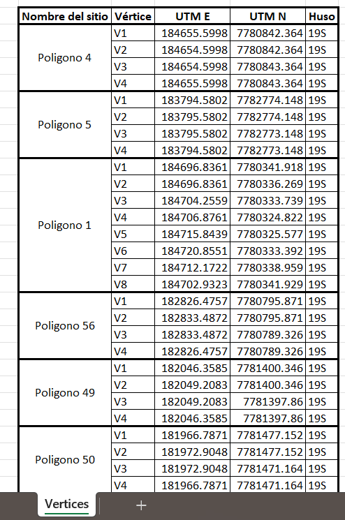

# QGIS-CAD-Vertex-Automation
### Flujo de trabajo automatizado en QGIS y Python para extraer, limpiar y dar formato a datos de vértíces de polígonos desde archivos CAD en un reporte Excel.
Automated workflow in QGIS and Python to extract, clean, and format polygon vertex data from CAD files into a Excel report.

# Extracción y Automatización de Vértices de Polígonos (CAD a Excel)

Este proyecto demuestra un flujo de trabajo automatizado para solucionar un problema común en ingeniería: la extracción masiva de coordenadas de vértices desde archivos CAD (DWG/DXF) para su presentación en un informe estructurado de Excel.

El proceso completo, desde la importación de datos brutos hasta la generación del reporte final, se ha encapsulado en un modelo de geoprocesamiento en QGIS y un script de post-procesamiento en Python.

### El Problema
Un cliente necesitaba una lista precisa de las coordenadas de los vértices para cientos de polígonos definidos en un archivo DWG a una tabla excel en formato establecido por su empresa, donde los nombres de cada polígono estaban asignados como textos separados y no como atributos directos. El proceso manual era propenso a errores y consumía una cantidad de tiempo inviable.

### La Solución Automatizada
Se desarrolló una solución integral que consta de dos componentes principales:

1.  **Modelo de Geoprocesamiento en QGIS:** Una herramienta personalizada que ejecuta 7 pasos de análisis espacial de forma secuencial y automática.
2.  **Script de Post-Procesamiento en Python:** Un script que toma la salida de QGIS y la transforma en un reporte de Excel con formato profesional, listo para ser entregado.

### Habilidades y Tecnologías Demostradas
* **Análisis Geoespacial Avanzado (QGIS):**
    * **Uniones Espaciales:** Asignación de atributos de texto a polígonos por cercanía (`Join attributes by nearest`).
    * **Manipulación de Geometrías:** Extracción automática de vértices de polígonos.
    * **Limpieza de Datos (Data QA/QC):** Creación de un Identificador Único (`UniqueID`) y eliminación de vértices duplicados para garantizar la integridad de los datos.
    * **Calculadora de Campos:** Uso de expresiones complejas (`concat`, `round`, `$x`, `$y`) para enriquecer los datos.
* **Automatización de Procesos:**
    * **Modelador Gráfico de QGIS:** Diseño y creación de un flujo de trabajo completo y reutilizable.
* **Scripting y Procesamiento de Datos (Python):**
    * **Pandas & GeoPandas:** Lectura de datos geoespaciales y manipulación de tablas.
    * **Openpyxl:** Creación y estilización de reportes en formato Excel, incluyendo la aplicación de bordes, combinación de celdas y formato de celdas.
    * **Lógica de Programación:** Limpieza y estandarización de datos de texto para asegurar una presentación consistente.
* **Interoperabilidad CAD-GIS:**
    * Manejo y solución de problemas en la importación de formatos DWG/DXF a un entorno GIS.

### Flujo de Trabajo
1.  **Asignación de Nombres:** El modelo une espacialmente los textos a su polígono más cercano.
2.  **Extracción de Vértices:** Se extraen todos los vértices de cada polígono.
3.  **Limpieza de Duplicados:** Se eliminan los vértices de cierre duplicados usando un ID único.
4.  **Cálculo de Coordenadas y Atributos:** Se añaden las coordenadas X/Y y un ID de vértice (V1, V2...).
5.  **Generación de Reporte:** El script de Python toma estos datos, los limpia, reordena y aplica un formato profesional en Excel.
